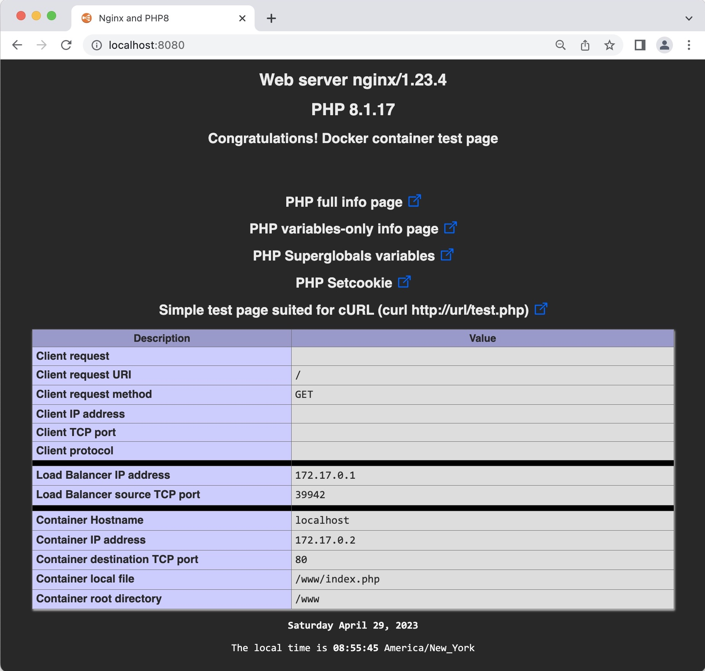

# Alpine Linux Nginx/PHP 8.1 for Docker
# Version
## Last Version
|Name|Version|
|:---|:---|
|**Alpine**|3.17.3|
|**NGINX**|1.23.4|
|**PHP8**|8.1.17|

# Introduction
This will build a Docker image, from scratch. It is based on Alpine Linux 3.17.3, Nginx 1.23.4 and PHP 8.1.
Three files will be copied on the `www` directory of the container.  
This container can be used to test a `load balancer` fronting a farm of web servers.
Just point your browser to your load balancer with the following url and the page gives you lots of information about the request.
```url
http://<load balancer>/phpvariables.php
```

1. `index.php` -> The main page when accessing the web server
2. `phpinfo.php` -> This is the phpinfo() function
3. `phpvariables.php` -> This is the phpinfo(INFO_VARIABLES) function
4. `superglobals.php` -> This is a self made file, based on phpinfo() function (not very useful 😀)
5. `setcookie.php` -> This sets a cookie (not very useful 😀)
6. `test.php` -> This is a base minimum HTML page suited for cURL

The build is a five step process:

1. Clone the files from github.
2. Download the Alpine mini root filesystem. We start our container with this. See an extract of the `Dockerfile`.
```Dockerfile
# Set master image
FROM scratch
ADD alpine-minirootfs-3.17.3-x86_64.tar.gz /
...
```
3. Build the Docker container.
4. Install Nginx, PHP 8.1 and execute some scripts to finalize the installation.
5. Run the container.

# Copy all the files needed to build the image
This will build a Docker image from scratch. It will be based on Alpine Linux 3.17.3 with Nginx web server and PHP 8.1.
```sh
# Copy all the files for GitHub to your local drive.
git clone https://github.com/ddella/PHP8-Nginx.git
cd PHP8-Nginx
```

If you don't have `git` installed, you can use cURL:
```sh
curl -L -o PHP8-Nginx.zip https://github.com/ddella/PHP8-Nginx/archive/refs/heads/main.zip
```

If you used `cURL`, unzip and cd in the directory:
```sh
unzip PHP8-Nginx.zip
cd PHP8-Nginx-main
```

# Alpine Mini Root FileSystem
Download Alpine mini root filesystem and place it in the same directory as the `Dockerfile`.
```sh
# Get the Alpine Mini Root FileSystem (~2.7MB).
curl -O https://dl-cdn.alpinelinux.org/alpine/v3.17/releases/x86_64/alpine-minirootfs-3.17.3-x86_64.tar.gz
```

# Build the Docker image from scratch
This command builds the Docker image. Don't forget the trailing period `(.)` at the end of the command.
```sh
docker build -t php8_nginx:3.17.3 .
```

# Running the container locally and sets the local timezone
The following commands will run your container and sets the timezone to EST.
```sh
docker run --rm -d -p 8080:80 -p 8443:443 \
--hostname=webserver \
--env TZ='EAST+5EDT,M3.2.0/2,M11.1.0/2' \
--env TIMEZONE='America/New_York' \
--name web php8_nginx:3.17.3
```

Port mapping for `HTTP`  : TCP port `80`, inside the container, will be mapped to port `8080` on the local host.  
Port mapping for `HTTPS` : TCP port `443`, inside the container, will be mapped to port `8443` on the local host.  
The  `8080` and  `8443` can be changed. They're the ports on the local Docker host.
The `TIMEZONE` environment variable is for PHP. See [PHP Timezone](https://www.php.net/manual/en/timezones.php).  
The `TZ` environment variable is for Linux. See [GNU](https://www.gnu.org/software/libc/manual/html_node/TZ-Variable.html).  
The `TZ`contains five fields. `[std][offset][dst],[start],[end]`  
. `[std]`: String of standard timezone  
. `[dst]`: String of daylight timezone  
. `[start]`: Start of Daylight time, see Mm.w.d  
. `[offset]`: The offset from UTC  
. `[end]`: End of Daylight time, Mm.w.d  
The month M`m` must be between 1 and 12  
The week `w` must be between 1 and 5  
The day `d` must be between 0 (Sunday) and 6  

# Testing the container
## HTTP
Open your browser and type the following url to access the default page of the container with HTTP.
```url
http://localhost:8080
```
## HTTPS
Open your browser and type the following url to access the default page of the container with HTTPS.
You will get an error from your browser about the `self signed` certificate. This error can be safely ignored.  
If this really bothers you, you can change the files `nginx-certificate.crt` and `nginx.key`.
```url
https://localhost:8443
```

## cURL
It might be usefull to test the container with cURL and get back a bare minimum web page.

This is how to call this minimal page with cURL:
```sh
curl http://localhost:8080/test.php
```

Same but with `HTTPS`:
```sh
curl --insecure https://localhost:8443/test.php
```

The result, in both cases is:

    Hello, Kubernetes from Pod [webserver] at IP [172.17.0.2]: Sat Apr 29 12:45:58 UTC 2023!

If you need to test load balancer H.A. or Kubernetes Cluster, open a terminal window and run cURL in a loop:
```sh
while true; do curl http://localhost:8080/test.php; sleep 0.8; done
```

>Adjust the sleep parameter to suits your need

# Terminate the container
This will terminate the container launched in the preceding step:
```sh   
docker rm -f web
```

# Size of the Docker image
The size of the Docker image is only ~36 Mb.

# Troubleshooting ONLY

## Shell access to the container
This command gives you a shell access to the container. Not to be used in production.
```sh
docker run -it --rm --entrypoint /bin/sh php8_nginx:3.17.3
```
>The container will terminate as soon as you exit the shell.

## Map container `www`directory locally
This will run the container and map a local directory, in our case `Downloads`, to the root directory of Nginx, `www`, inside the container.  
That gives you the possibility to change (test) the `html` or `php` files without rebuilding the image.
```sh
docker run --rm -d -p 8080:80 -p 8443:443 --name web \
--hostname=webserver \
--env TZ='EAST+5EDT,M3.2.0/2,M11.1.0/2' \
--env TIMEZONE='America/New_York' \
-v ~/Downloads/:/www \
php8_nginx:3.17.3
```

## Map container `log`directory locally
This will run the container and map a local directory, in our case `Downloads`, to the log directory of Nginx, `/var/log/nginx`, inside the container.  
That gives you the possibility to look at the Nginx log files.
```sh
docker run --rm -d -p 8080:80 -p 8443:443 --name web \
--hostname webserver
--env TZ='EAST+5EDT,M3.2.0/2,M11.1.0/2' \
--env TIMEZONE='America/New_York' \
-v ~/Downloads/:/var/log/nginx \
php8_nginx:3.17.3
```

## Main page
This is the main page for the site.



## Restarting Nginx inside a Docker container
If you need to restart nginx, try to reload the configuration instead of restarting the service.
This could be useful if you make modification on the `nginx.conf`.

```command
docker exec web nginx -s reload
```

If you must restart the nginx process, restart the container using the command:

```command
docker restart web
```

## Terminate container
Just type `exit` in the container's shell to quit and terminate the container.

## [CHANGELOG](./CHANGELOG.md)

# Docker Compose
I've included a `docker-compose.yml` for Docker Compose. I ran into an issue for terminating the project. See the instructions [here](docker-compose.md).

# License
This project is licensed under the [MIT license](LICENSE).
