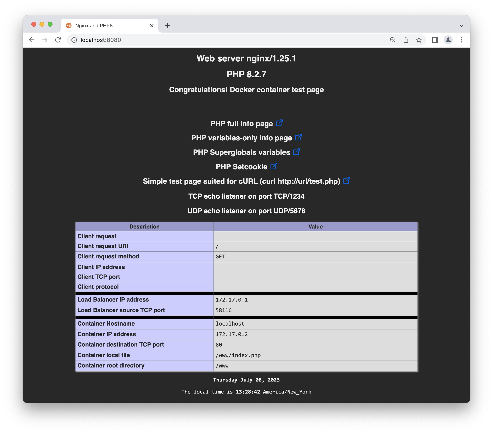

# Alpine Linux Nginx/PHP 8.1 for Docker
# Version
## Last Version
|Name|Version|
|:---|:---|
|**Alpine**|3.18.2|
|**NGINX**|1.23.4|
|**PHP8**|8.1.17|

# Introduction
This will build a Docker image, from scratch. It is based on Alpine Linux 3.18.2, Nginx 1.23.4 and PHP 8.1.
Three files will be copied on the `www` directory of the container.  
This container can be used to test a `load balancer` fronting a farm of web servers.
Just point your browser to your load balancer with the following url and the page gives you lots of information about the request.
```url
http://<load balancer>/phpvariables.php
```

1. `index.php` -> The main page when accessing the web server
2. `phpinfo.php` -> This is the phpinfo() function
3. `phpvariables.php` -> This is the phpinfo(INFO_VARIABLES) function
4. `superglobals.php` -> This is a self made file, based on phpinfo() function (not very useful 😀)
5. `setcookie.php` -> This sets a cookie (not very useful 😀)
6. `test.php` -> This is a base minimum HTML page suited for cURL

The build is a five step process:

1. Clone the files from github.
2. Download the Alpine mini root filesystem. We start our container with this. See an extract of the `Dockerfile`.
```Dockerfile
# Set master image
FROM scratch
ADD alpine-minirootfs-3.18.2-x86_64.tar.gz /
...
```
3. Build the Docker container.
4. Install Nginx, PHP 8.1 and execute some scripts to finalize the installation.
5. Run the container.

# Copy all the files needed to build the image
This will build a Docker image from scratch. It will be based on Alpine Linux 3.18.2 with Nginx web server and PHP 8.1.
```sh
# Copy all the files for GitHub to your local drive.
git clone https://github.com/ddella/PHP8-Nginx.git
cd PHP8-Nginx
```

If you don't have `git` installed, you can use cURL:
```sh
curl -L -o PHP8-Nginx.zip https://github.com/ddella/PHP8-Nginx/archive/refs/heads/main.zip
```

If you used `cURL`, unzip and cd in the directory:
```sh
unzip PHP8-Nginx.zip
cd PHP8-Nginx-main
```

# Alpine Mini Root FileSystem
Download Alpine mini root filesystem and place it in the same directory as the `Dockerfile`.
```sh
# Get the Alpine Mini Root FileSystem (~2.7MB).
curl -O https://dl-cdn.alpinelinux.org/alpine/v3.17/releases/x86_64/alpine-minirootfs-3.18.2-x86_64.tar.gz
```

# Build the Docker image from scratch
This command builds the Docker image. Don't forget the trailing period `(.)` at the end of the command.
```sh
docker build -t php8_nginx:3.18.2 .
```

Check the image, with a filter:
```sh
docker images php8_nginx:3.18.2
```

Check the image without any filter:
```sh
docker image ls
```

>**Note:** If you don't want to filter use the command: `docker image ls` (no 'S' in image)

The size of the Docker image is only ~36 Mb.

# Running the container locally and sets the local timezone
This will run the container and map a local directory, in our case `$PWD`, to the root directory of Nginx, `www`, inside the container.  
That gives you the possibility to change (test) the `html` or `php` files without rebuilding the image.
```sh
docker run --rm -d -p 8080:80 -p 8443:443 --name web \
--hostname=webserver \
--env TZ='EAST+5EDT,M3.2.0/2,M11.1.0/2' \
--env TIMEZONE='America/New_York' \
--env TCP_PORT=1234 \
--env UDP_PORT=5678 \
--mount type=bind,source="$(pwd)"/www,target=/www,readonly \
php8_nginx:3.18.2
```

Port mapping for `HTTP`  : TCP port `80`, inside the container, will be mapped to port `8080` on the local host.  
Port mapping for `HTTPS` : TCP port `443`, inside the container, will be mapped to port `8443` on the local host.  
The  `8080` and  `8443` can be changed. They're the ports on the local Docker host.
The `TIMEZONE` environment variable is for PHP. See [PHP Timezone](https://www.php.net/manual/en/timezones.php).  
The `TZ` environment variable is for Linux. See [GNU](https://www.gnu.org/software/libc/manual/html_node/TZ-Variable.html).  
The `TZ`contains five fields. `[std][offset][dst],[start],[end]`  
The `TCP_PORT` environment variable is for `socat` TCP listener  
The `UDP_PORT` environment variable is for `socat` UDP listener  
. `[std]`: String of standard timezone  
. `[dst]`: String of daylight timezone  
. `[start]`: Start of Daylight time, see Mm.w.d  
. `[offset]`: The offset from UTC  
. `[end]`: End of Daylight time, Mm.w.d  
The month M`m` must be between 1 and 12  
The week `w` must be between 1 and 5  
The day `d` must be between 0 (Sunday) and 6  

# Testing the container
## HTTP
Open your browser and type the following url to access the default page of the container with HTTP.
```url
http://localhost:8080
```
## HTTPS
Open your browser and type the following url to access the default page of the container with HTTPS.
You will get an error from your browser about the `self signed` certificate. This error can be safely ignored.  
If this really bothers you, you can change the files `nginx-certificate.crt` and `nginx.key`.
```url
https://localhost:8443
```

## cURL
It might be usefull to test the container with cURL and get back a bare minimum web page.

This is how to call this minimal page with cURL:
```sh
curl http://localhost:8080/test.php
```

Same but with `HTTPS`:
```sh
curl --insecure https://localhost:8443/test.php
```

The result, in both cases is:
```
Hello, Kubernetes from Pod [webserver] at IP [172.17.0.2]: Sat Apr 29 12:45:58 UTC 2023!
```

If you need to test load balancer H.A. or Kubernetes Cluster, open a terminal window and run `cURL` in a loop:
```sh
while true; do curl http://localhost:8080/test.php; sleep 1.0; done
```

>Adjust the sleep parameter to suits your need

## NC
You can use `nc` to test for either a `TCP` or `UDP` listener that was started before Nginx:
```sh
nc 127.0.0.1 1234
nc 127.0.0.1 -u 5678
```

# Terminate the container
This will terminate the container launched in the preceding step:
```sh   
docker rm -f web
```

# Troubleshooting ONLY

## Shell access to the container
This command **starts a NEW** container and gives you a shell access to it. Do not use this command to start a container in production. The container will terminate as soon as you exit the shell.
```sh
docker run -it --rm --entrypoint /bin/sh php8_nginx:3.18.2
```
>`php8_nginx:3.18.2` is the image used to start the container.

If the container is already running and you want to jump insside, use this command:
```sh
docker exec -it web /bin/sh
```

>`web` is the name of the running container to jump inside.

## Map container `log` directory locally
This will run the container and map a local directory, in our case `$PWD/www`, to the log directory of Nginx, `/var/log/nginx`, inside the container.

That gives you the possibility to look at the Nginx access log and/or error log files.
```sh
docker run --rm -d -p 8080:80 -p 8443:443 --name web \
--hostname=webserver \
--env TZ='EAST+5EDT,M3.2.0/2,M11.1.0/2' \
--env TIMEZONE='America/New_York' \
--mount type=bind,source="$(pwd)"/www,target=/www,readonly \
--mount type=bind,source="$(pwd)"/www,target=/var/log/nginx \
php8_nginx:3.18.2
```

Open a terminal and look at the file `access.log` or `error.log`:
```sh
tail -f www/access.log
```

## Main page
This is the main page for the site.



## Restarting Nginx inside a Docker container
If you need to restart nginx, try to reload the configuration instead of restarting the service.
This could be useful if you make modification on the `nginx.conf`.

```sh
docker exec web nginx -s reload
```

If you must restart the nginx process, restart the container using the command:

```sh
docker restart web
```

## Terminate container
Just type `exit` in the container's shell to quit and terminate the container.

## [CHANGELOG](./CHANGELOG.md)

# Docker Compose
I've included a `docker-compose.yml` for Docker Compose. I ran into an issue for terminating the project. See the instructions [here](docker-compose.md).

# Kubernetes
I had a special case where I needed that container to run as a Pod on every worker node in Kubernetes Cluster. I created a `daemonset` so each worker node would have a Pod running in it's own namespace:

## Create the K8s manifest
Create the `yaml` file with the command below:
```sh
cat > echo-server.yaml<<EOF
apiVersion: v1
kind: Namespace
metadata:
  name: echo-server
---
apiVersion: apps/v1
kind: DaemonSet
metadata:
  name: echo-server
  namespace: echo-server
  labels:
    app: echo-server
    k8s-app: echo-server
spec:
  selector:
    matchLabels:
      name: echo-server
  template:
    metadata:
      labels:
        name: echo-server
    spec:
      containers:
      - name: echo-server
        image: php8_nginx:3.18.2
        env:
        - name: TCP_PORT
          value: "1234"
        - name: UDP_PORT
          value: "5678"
        - name: TZ
          value: "EAST+5EDT,M3.2.0/2,M11.1.0/2"
        - name: TIMEZONE
          value: "America/New_York"
        resources:
          limits:
            memory: 100Mi
          requests:
            cpu: 100m
            memory: 100Mi
EOF
```

>**Note:** The image must reside on your Kubernetes Cluster for **EACH** worker node. See my light tutorial on creating a Docker image and tranfering that image to the local K8s registry [here](https://github.com/ddella/Kubernetes-Cluster/blob/main/K8s-Local-Image.md).

## Create Daemon Set
Create the Pods with the command:
```sh
kubectl create -f echo-server.yaml
```

Check that there's one Pod per worker node:
```sh
kubectl get pods -n echo-server -o wide
```

## Delete Daemon Set
Create the Pods with the command:
```sh
kubectl delete -f echo-server.yaml
```

# License
This project is licensed under the [MIT license](LICENSE).
